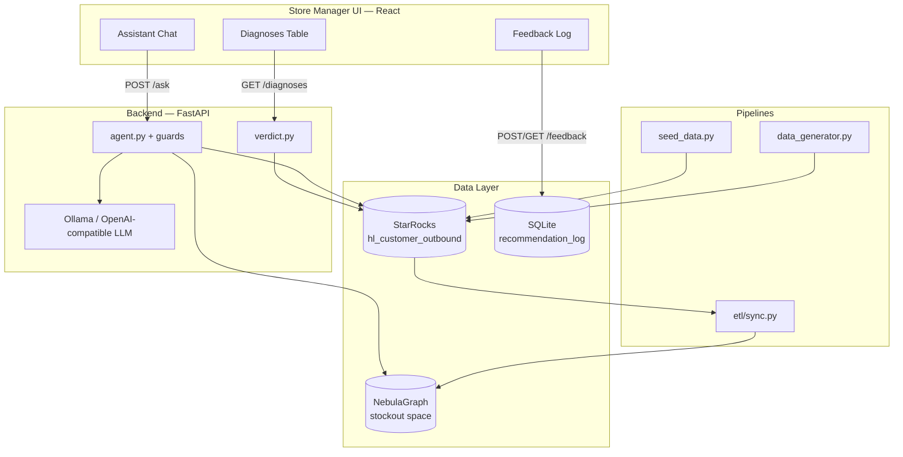
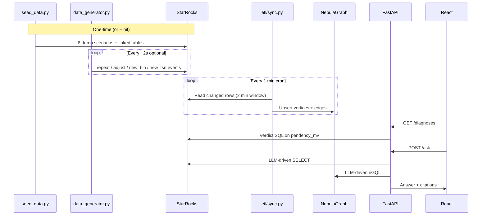

# Stockout Diagnosis POC

Automated **BIN–FSN stockout diagnosis** for hyperlocal dark stores. When pickers raise **Item Not Found (INF)** tickets, this system classifies failure patterns (PHANTOM, GENUINE STOCKOUT, DUAL, AMBIGUOUS), traces upstream causes (inventory, reservations, inbound/putaway), and exposes a **React dashboard** plus an **LLM assistant** with cited SQL and graph queries.

**Design reference:** [docs/DESIGN.md](docs/DESIGN.md)

---

## Problem (30 seconds)

- **BIN** = physical slot label (e.g. `F1-05-5D`)
- **FSN** = product identifier (Flipkart Serial Number — same role as a SKU)
- **INF** = picker could not find the FSN at the assigned bin → order fails

Existing signals show *what* is failing; this POC shows *why* and *what to do*, in minutes instead of days.

---

## Architecture



| Layer | Technology | Role |
|-------|------------|------|
| OLAP source | StarRocks 3.2 (Docker) | INF events, inventory, inbound, reservations |
| Graph | NebulaGraph 3.6 (Docker) | Multi-hop tracing (inbound path, reservation, failures) |
| Feedback | SQLite (`.data/recommendation.db`) | Analyst actions and outcomes |
| Backend | FastAPI + Python 3 | Verdict SQL, LLM agent, query guardrails |
| LLM | Ollama (default `llama3.1:8b`) or any OpenAI-compatible API | Tool-calling agent |
| Frontend | React + Vite | Diagnoses, assistant, feedback |

---

## Prerequisites

- Docker Desktop (StarRocks + NebulaGraph)
- Python 3.10+
- Node.js 18+ (frontend)
- [Ollama](https://ollama.com) with a tool-capable model, e.g.:

```bash
ollama pull llama3.1:8b
ollama serve
```

---

## Quick start

```bash
cd stockout-diagnosis

# Python deps
python3 -m venv .venv
source .venv/bin/activate
pip install -r requirements.txt

# Environment (copy and edit)
cp .env.example .env   # or create .env — see Configuration below

# Full stack: Docker + schema + seed + ETL + backend + frontend
./dev.sh up --init

# Optional: live fake warehouse events
./dev.sh generator-start

# Optional: ETL every minute (StarRocks → NebulaGraph)
./dev.sh cron-install
```

Open **http://localhost:5173** (frontend). API: **http://localhost:8000**.

Verify:

```bash
./dev.sh check
./dev.sh smoke          # API + LLM sanity test
curl http://localhost:8000/diagnoses
```

---

## `dev.sh` commands

| Command | Description |
|---------|-------------|
| `./dev.sh up` | Start Docker, auto-seed if DB empty, start backend + frontend |
| `./dev.sh up --init` | Force truncate + re-seed demo data + full graph sync |
| `./dev.sh down` | Stop apps; keep container data |
| `./dev.sh down --purge` | Remove containers (volumes kept) |
| `./dev.sh down --purge --wipe-volumes` | Full Docker reset |
| `./dev.sh check` | Status of Docker, DB, Ollama, processes |
| `./dev.sh generator-start` / `generator-stop` | Fake INF stream → `logs/data_generator.log` |
| `./dev.sh cron-install` / `cron-remove` | Minute ETL cron → `logs/etl.log` |
| `./dev.sh smoke` | Quick end-to-end API test |

---

## End-to-end data flow



### 1. Schema (`data/apply_schema.py`)

Creates 13 StarRocks tables in `hl_customer_outbound` — see [docs/DESIGN.md §6](docs/DESIGN.md#6-source-data-schema).

### 2. Seed (`data/seed_data.py`)

One-time baseline from `data/scenarios.py` → **8 INF rows** covering five stories:

| Story | FSN(s) | Bin | Diagnosis angle |
|-------|--------|-----|-----------------|
| A — PHANTOM | A1, A2, A3 | `F1-05-5D` | ≥3 FSNs fail in one bin |
| B — GENUINE | B1 | `F3-01-2A`, `F3-01-2B` | Same FSN, 2 bins |
| C — RESERVATION | C1 | `F1-02-3C` | Stock locked by reservation |
| D — Not shelved | D1 | `F2-05-1A` | GRN exists, CRI not put away |
| H — Variance | H1 | `F4-01-1A` | Inventory with no GRN |

### 3. Generator (`data/data_generator.py`)

Continuous fake activity (optional). Event rotation:

```
repeat → repeat → inventory_adjust → new_bin → new_fsn
```

| Event | Behavior |
|-------|----------|
| `repeat` | Same seeded bin+FSN, new order/INF |
| `inventory_adjust` | Update ATP/qty on A1/B1/H1/D1, then INF |
| `new_bin` | Existing FSN in new bin `F5-xx-1A` + inbound |
| `new_fsn` | New SKU `FSN-S{n}`; every 3rd has no GRN (variance) |

State: `data/.data_generator_state.json`.

### 4. ETL (`etl/sync.py`)

Syncs all 13 StarRocks tables (+ `reservation_items`) into NebulaGraph nodes/edges. Incremental window: last **2 minutes** (configurable). Full sync after seed: `python etl/sync.py --full`.

---

## Verdict logic (dashboard)

Computed in `backend/verdict.py` over **last 7 days** of `pendency_mv`:

| Verdict | Condition | Typical action |
|---------|-----------|----------------|
| **PHANTOM** | ≥3 distinct FSNs with INF in the same bin | Stocktake bin |
| **GENUINE_STOCKOUT** | ≥2 distinct bins with INF for the same FSN | Replenish |
| **DUAL** | Both thresholds | Stocktake + replenish |
| **AMBIGUOUS** | Neither threshold | Upstream investigation (inventory → reservation → GRN/CRI) |

Active INF filter: `irt_ticket_id IS NOT NULL` AND `irt_ticket_type IN ('INF','SMART_FULFILLMENT')`.

---

## API

| Method | Path | Description |
|--------|------|-------------|
| `GET` | `/health` | Service OK + ask timeout budgets |
| `GET` | `/diagnoses?warehouse_id=` | Ranked verdict rows |
| `POST` | `/ask` | LLM assistant — body: `{ question, warehouse_id, depth_mode }` |
| `POST` | `/feedback` | Record analyst action |
| `GET` | `/feedback?warehouse_id=` | List feedback rows |

**`depth_mode`:** `FAST` (10s budget) or `THOROUGH` (30s). See [docs/DESIGN.md §5.5](docs/DESIGN.md#55-llm-agent-design).

---

## LLM assistant (summary)

- **Tools:** `query_starrocks(sql)`, `query_nebulagraph(ngql)` only
- **Default model:** Ollama `llama3.1:8b` (local, cost-effective)
- **Guardrails:** SELECT-only SQL, warehouse scoping, row cap (50), snapshot time at ask start, max iterations, timeout budgets
- **Deterministic helpers:** Auto-bootstrap verdict+inventory SQL; auto-run graph traversals; synthesize answer if model stalls or hallucinates

Smaller models need these guardrails; larger models (Claude Sonnet, GPT-4 class) improve tool-call reliability and reduce fallback synthesis.

---

## Configuration

Create `.env` in the project root:

```bash
# StarRocks
SR_HOST=127.0.0.1
SR_PORT=9030
SR_USER=root
SR_PASSWORD=
SR_DB=hl_customer_outbound

# NebulaGraph
NEBULA_HOST=127.0.0.1
NEBULA_PORT=9669
NEBULA_USER=root
NEBULA_PASSWORD=nebula
NEBULA_SPACE=stockout

# Warehouse
WAREHOUSE_DEFAULT=WH_BLR_01

# LLM (Ollama default)
LLM_BASE_URL=http://localhost:11434/v1
LLM_API_KEY=ollama
LLM_MODEL=llama3.1:8b

# Ask budgets (ms)
ASK_TOTAL_TIMEOUT_MS=10000
ASK_THOROUGH_TIMEOUT_MS=30000
ASK_MAX_ITERATIONS=12
ASK_PER_QUERY_TIMEOUT_MS=5000

# ETL
ETL_WINDOW_MINUTES=2

# Generator (optional)
STREAM_INTERVAL_S=2
STREAM_BATCH_SIZE=2

# Feedback SQLite
FEEDBACK_DB_PATH=.data/recommendation.db
```

Frontend (optional): `frontend/.env` — `VITE_API_BASE`, `VITE_WAREHOUSE_ID`.

---

## Project structure

```
stockout-diagnosis/
├── backend/           # FastAPI, agent, verdict, guards, prompts
├── frontend/          # React dashboard
├── data/              # Schema, seed, scenarios, generator
├── etl/               # StarRocks → NebulaGraph sync
├── graph/             # NebulaGraph schema (schema.ngql)
├── docs/              # DESIGN.md
├── dev.sh             # Stack orchestration
├── docker-compose.yml # StarRocks + NebulaGraph
└── requirements.txt
```

---

## Manual operations

```bash
# Schema only
python data/apply_schema.py
python data/apply_graph_schema.py

# Seed only
python data/seed_data.py

# One generator batch
python data/data_generator.py --once

# ETL
python etl/sync.py --full
python etl/sync.py          # incremental

# Backend / frontend (if not using dev.sh)
uvicorn backend.main:app --reload --port 8000
cd frontend && npm install && npm run dev
```

---

## Logs

| Log | Source |
|-----|--------|
| `logs/backend.log` | FastAPI |
| `logs/frontend.log` | Vite |
| `logs/data_generator.log` | Fake data stream |
| `logs/etl.log` | Cron ETL (after `cron-install`) |

---

## Key terms

| Term | Meaning |
|------|---------|
| **FSN** | Product / SKU identifier |
| **BIN** | Physical storage slot label |
| **INF** | Item Not Found — pick failure |
| **IRT** | Inventory Reconciliation Ticket |
| **GRN** | Goods Receipt Note |
| **CRI** | Consignment Receiving Instance — receipt line + putaway location |
| **ATP** | Available to promise quantity |

---
