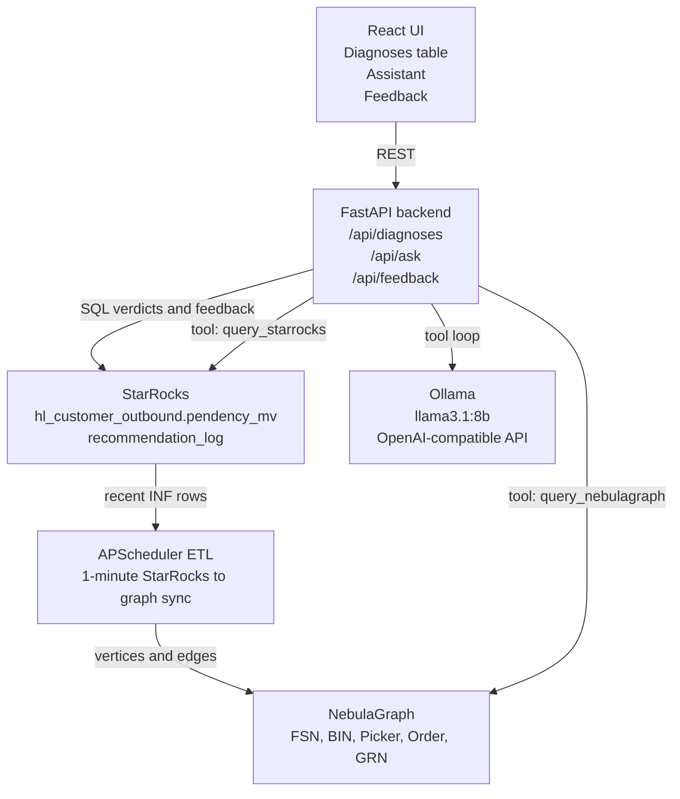

# BIN-FSN Stockout Diagnosis - Design Document

> Status: Current design, post-M11 Ollama migration  
> Owner: Intern project  
> Audience: Engineering leads, store-ops stakeholders, project reviewers  
> Related: [../explanation/context-repository.md](../explanation/context-repository.md), [milestones.md](milestones.md), [../docs/learning/README.md](../docs/learning/README.md)

---

## 1. Executive Summary

BIN-FSN Stockout Diagnosis is a web UI plus graph/LLM assistant for diagnosing warehouse pick failures. When a picker cannot find an item in its assigned BIN, the event becomes an INF-like failure and may create an IRT. Today, the existing signal can show which FSN/BIN combinations are failing, but the root-cause investigation still requires manual work across dashboards and can take 3-5 days.

This project reduces that investigation to minutes by:

- reading recent INF-like events from StarRocks;
- applying deterministic verdict rules from the problem statement;
- syncing useful relationships into NebulaGraph;
- letting an Ollama-powered assistant query SQL and graph evidence with citations;
- tracking recommendation outcomes through a feedback loop.

The design deliberately keeps the deterministic SQL verdict as the foundation. Graph evidence and the LLM assistant enrich and explain the diagnosis, but the system remains useful even if NebulaGraph or Ollama is temporarily unavailable.

---

## 2. Problem Statement

| Field | Detail |
| --- | --- |
| Context | In Flipkart Hyperlocal dark stores, items are identified by FSN and stored in physical BIN locations such as `F1-05-5D`. When a picker cannot find an item in a BIN, they raise an INF-like event, which can create an IRT and hurt fill rate. |
| Problem | Existing signals identify repeated failing FSN/BIN pairs, but they do not explain whether the failure is caused by phantom inventory, true stockout, picker/process issues, inbound problems, or stale inventory state. |
| Goal | Produce actionable, evidence-backed diagnoses in minutes instead of 3-5 days. |
| Primary actions | Stocktake the BIN for phantom inventory; replenish the FSN for genuine stockout; investigate both for dual cases. |
| Non-goals | No new StarRocks materialized views, no Slack/email/push automation, no unattended stocktake execution, no ML forecasting, no picker coaching, no LLM fine-tuning. |
| Success targets | Verdict accuracy >= 70% vs analyst judgment; end-to-end latency < 10s for normal interactions; 100% citation coverage for assistant claims; pilot for at least one dark store. |

---

## 3. Core Diagnosis Logic

The core business logic is a two-axis classification over recent INF-like failures.

| Pattern | Interpretation | Operational action |
| --- | --- | --- |
| Many distinct FSNs fail in the same BIN | Phantom inventory | Stocktake the BIN |
| The same FSN fails across many BINs | Genuine stockout | Replenish the FSN |
| Both patterns are present | Dual signal | Stocktake and replenish/investigate |
| Neither pattern is strong | Ambiguous | Investigate manually with evidence |

The deterministic verdict rule is:

```text
distinct_fsns >= 3 AND distinct_bins >= 2 -> DUAL
distinct_fsns >= 3                        -> PHANTOM_INVENTORY
distinct_bins >= 2                        -> GENUINE_STOCKOUT
else                                      -> AMBIGUOUS
```

The default diagnosis window is recent data from the last one day. This keeps the result operationally relevant while avoiding stale failures from permanently affecting the diagnosis.

---

## 4. Current Architecture



| Layer | Technology | Responsibility |
| --- | --- | --- |
| Frontend | React | Shows diagnoses, assistant answers, citations, and feedback status. |
| Backend | FastAPI | Owns HTTP routes, orchestration, validation, config, and scheduler startup. |
| Analytics store | StarRocks | Stores `pendency_mv` demo source and computes count-based verdicts. |
| Feedback store | StarRocks `recommendation_log` | Stores recommendation lifecycle and before/after failure counts. |
| Graph store | NebulaGraph | Stores multi-hop relationships for picker, GRN, order, BIN, and FSN evidence. |
| ETL | Python + APScheduler | Copies recent rows from StarRocks into NebulaGraph every minute. |
| Assistant | Ollama `llama3.1:8b` | Uses guarded SQL/nGQL tools and returns cited explanations. |
| Infra | Docker Compose | Runs local StarRocks, NebulaGraph, backend, frontend, and scripts. |

---

## 5. Runtime Flows

### 5.1 Diagnoses Table

```text
React DiagnosesTable
  -> GET /api/diagnoses?warehouse_id=...
  -> FastAPI diagnoses router
  -> diagnosis service runs verdict SQL in StarRocks
  -> rows are ranked and returned as JSON
  -> React renders verdict, counts, recovery estimate, and Log Rec action
```

The diagnoses endpoint is intentionally deterministic. It does not require the LLM to produce a verdict.

### 5.2 Graph Sync

```text
FastAPI startup
  -> initializes NebulaGraph connection pool
  -> starts APScheduler
  -> run_etl_sync executes every 1 minute
  -> reads rows newer than the in-memory watermark
  -> writes FSN, BIN, Picker, Order, GRN vertices and edges
```

The graph is not the source of truth for the base verdict. It is an explanation and investigation layer.

### 5.3 Assistant

```text
React Assistant
  -> POST /api/ask
  -> agent.py starts an Ollama tool loop
  -> generated SQL/nGQL is validated by guards.py
  -> StarRocks and/or NebulaGraph tools return capped evidence
  -> every successful tool result becomes a citation
  -> answer is returned with citations, partial flag, iterations, and elapsed_ms
```

The assistant is not allowed to answer factual warehouse questions from memory. It must ground claims in tool results.

### 5.4 Feedback Loop

```text
Diagnosis row
  -> user clicks Log Rec
  -> POST /api/feedback creates recommendation_log row
  -> backend captures failures_before
  -> user advances suggested -> acknowledged -> executed -> verified
  -> backend captures failures_after and resolved_at
  -> Feedback view shows whether failures ceased
```

This closes the loop from diagnosis to action to outcome.

---

## 6. Data Model

### 6.1 StarRocks Source: `hl_customer_outbound.pendency_mv`

The production design reads only the prescribed source view/table and does not create new StarRocks materialized views.

| Column | Meaning |
| --- | --- |
| `reservation_warehouse_id` | Warehouse or dark-store identifier. |
| `picklist_source_location_label` | Physical BIN label. |
| `picklist_item_fsn` | Product identifier. |
| `irt_ticket_id` | Non-null value marks an INF-like failure used for diagnosis. |
| `irt_ticket_type` | Ticket category, pending exact production enum confirmation. |
| `picklist_assigned_to` | Picker identifier. |
| `order_id` | Impacted customer order. |
| `updated_at` | Event/update timestamp used for diagnosis windows and ETL watermarking. |
| `grn_id` | Demo-added inbound batch field used to demonstrate shared-GRN signals. |

### 6.2 NebulaGraph

| Graph element | Purpose |
| --- | --- |
| `FSN` vertex | Product/item. |
| `BIN` vertex | Compound warehouse/BIN physical location. |
| `Picker` vertex | Picker involved in pick attempts. |
| `Order` vertex | Customer order touched by the failure. |
| `GRN` vertex | Inbound batch/goods receipt reference. |
| `FAILED_AT` edge | Connects FSN to BIN failure location. |
| `PICKED_FROM` edge | Connects order to BIN. |
| `ASSIGNED_TO` edge | Connects picker to BIN/pick responsibility. |
| `RECEIVED_IN` edge | Connects FSN to GRN. |
| `PUTAWAY_TO` edge | Connects GRN to BIN. |

BIN vertex IDs use a compound format:

```text
warehouse_id:bin_label
```

This prevents the same BIN label in different warehouses from being incorrectly merged.

### 6.3 Feedback: `recommendation_log`

| Column | Meaning |
| --- | --- |
| `id` | Primary key. |
| `warehouse_id`, `bin`, `fsn` | Diagnosis key. |
| `verdict` | `PHANTOM_INVENTORY`, `GENUINE_STOCKOUT`, `DUAL`, or `AMBIGUOUS`. |
| `action` | Derived server-side from verdict. |
| `status` | `suggested`, `acknowledged`, `executed`, or `verified`. |
| `suggested_at`, `resolved_at` | Lifecycle timestamps. |
| `evidence_ref` | Lightweight evidence pointer captured at recommendation time. |
| `failures_before`, `failures_after` | Counts used to compute whether failures decreased or ceased. |

---

## 7. Graph and Assistant Signals

| Signal | Question answered | Evidence source |
| --- | --- | --- |
| Picker overlap | Are failures concentrated around one picker or process path? | NebulaGraph picker/BIN relationships. |
| Shared GRN | Did failing FSNs share an inbound batch or putaway path? | NebulaGraph FSN-GRN-BIN relationships. |
| Stocktake/IRT feedback | Did an operational action reduce future failures? | `recommendation_log` and failure counts. |
| ATP proxy | Is a genuine stockout likely because the FSN fails across many BINs? | SQL-derived proxy in demo; production should call a real ATP/inventory service. |

Current implementation choice: graph signals are queried dynamically by the assistant instead of being precomputed for every `/api/diagnoses` row. This keeps the table fast and lets the assistant ask only the graph questions relevant to the user's natural-language question.

---

## 8. Technical Decisions

This section distills the project decisions captured across `docs/learning/*/technical-decisions.md` and `important-tech-decisions.md`.

### TD-1: Deterministic Rules Are The Verdict Source

The base verdict uses the problem-statement SQL thresholds instead of a trained model. This makes every verdict explainable, testable, and comparable against analyst judgment. ML forecasting and custom classifiers remain out of scope.

Trade-off: rigid thresholds may mark some real issues as `AMBIGUOUS`. The mitigation is to expose raw counts, graph evidence, citations, and human feedback.

### TD-2: StarRocks For Aggregation, NebulaGraph For Relationships

StarRocks is the right place for count-based questions such as distinct FSNs per BIN and distinct BINs per FSN. NebulaGraph is used for relationship questions such as picker overlap, shared GRN, and multi-hop investigation.

Decision summary:

```text
StarRocks = verdict source
NebulaGraph = enrichment and explanation source
```

### TD-3: Graph And LLM Are Additive, Not Blocking

If graph sync fails or Ollama is down, the deterministic `/api/diagnoses` endpoint can still return useful results. This protects the operational workflow from optional enrichment failures.

### TD-4: Read Only `pendency_mv`; Do Not Add StarRocks MVs

The system follows the guardrail to read only `hl_customer_outbound.pendency_mv` for raw warehouse failure data. The local demo creates a table with the same role because production data is unavailable locally, but the design does not depend on new materialized views.

### TD-5: Store Feedback Separately In `recommendation_log`

The app owns recommendation lifecycle data because it represents system actions and outcomes, not raw warehouse source facts. For the demo, this table lives in StarRocks to keep infrastructure small and allow easy comparison with failure counts.

Production caveat: a transactional database such as PostgreSQL or MySQL would be cleaner for lifecycle updates at scale.

### TD-6: Keep Backend Layers Separated

Backend code is split by responsibility:

```text
routers  = HTTP request/response handling
services = business logic and orchestration
db       = StarRocks and NebulaGraph clients
```

This keeps endpoint code thin and makes diagnosis, assistant, ETL, and feedback behavior easier to test or change independently.

### TD-7: Centralized Config With Environment Overrides

`backend/config.py` centralizes StarRocks, NebulaGraph, LLM, diagnosis, and assistant settings. Defaults keep the demo easy to run, while `.env` and environment variables allow Docker and production-style overrides.

### TD-8: Short-Lived StarRocks Connections, Pooled NebulaGraph Sessions

StarRocks uses simple short-lived PyMySQL connections, which is acceptable for the demo. NebulaGraph uses a shared connection pool because the client is pool-oriented and graph sessions are reused across requests and ETL work.

Production caveat: StarRocks should use a real connection pool under higher traffic.

### TD-9: ETL Runs Inside FastAPI For Demo Simplicity

APScheduler runs `run_etl_sync` every minute inside the backend process. This avoids an extra worker service and keeps local setup simple.

Production caveat: if multiple backend replicas run, each could execute the same job. A production deployment should move ETL into a separate worker/scheduler with persisted watermarking and monitoring.

### TD-10: Incremental ETL Uses An In-Memory Watermark

The ETL reads rows newer than `_watermark`, initially set far in the past so the first run copies all seed data. Graph writes use `IF NOT EXISTS` to make repeated syncs safe for the demo.

Production caveat: the watermark should be persisted, and repeated events should have a deliberate update/multi-edge strategy.

### TD-11: Ollama Replaced The Older Cloud Two-Model Design

The current assistant uses one local Ollama model, `llama3.1:8b`, through an OpenAI-compatible client.

Benefits:

- no per-token cloud cost;
- better data privacy for warehouse data;
- simpler local setup once Ollama is installed;
- model can be swapped through config.

Trade-off: smaller local models need more deterministic guardrails and fallback logic.

### TD-12: Assistant Queries Are Guarded And Cited

All LLM-generated SQL and nGQL is validated before execution. The assistant tools are read-only, row-capped, and citation-producing. The agent includes defensive fallbacks for JSON recovery, SQL extraction, timeout synthesis, and hallucination blocking.

This supports the hard project requirement that every assistant claim should be backed by evidence.

### TD-13: FAST And THOROUGH Assistant Modes

The assistant supports a quick operational mode and a deeper investigation mode:

```text
FAST     = 10 second budget
THOROUGH = 30 second budget
```

The response includes metadata such as `partial`, `iterations`, and `elapsed_ms` so debugging assistant behavior is easier.

### TD-14: Feedback Transitions Are Enforced Server-Side

Feedback status must move in order:

```text
suggested -> acknowledged -> executed -> verified
```

The frontend can show the next action, but the backend enforces valid transitions and derives the operational action from the verdict. This avoids frontend/backend drift and protects the audit trail.

### TD-15: Demo Data Is Deterministic

The seed generator creates known scenarios for phantom inventory, genuine stockout, dual patterns, picker-driven clusters, shared-GRN clusters, ambiguous noise, and resolved cases. This makes demos predictable and helps validate the verdict rules.

Continuous generation is separate from one-time seeding so the project can support both reproducible demos and live-event simulation.

---

## 9. UI Surfaces

| Surface | Purpose |
| --- | --- |
| Diagnoses Table | Shows ranked diagnosis rows with verdict, counts, recovery estimate, and recommendation logging. |
| Ask The Assistant | Accepts natural-language questions and returns cited SQL/graph-backed explanations. |
| Feedback View | Tracks recommendations through action and outcome, including before/after failure counts. |

The UI is intentionally operational rather than decorative: operators should quickly see what is failing, why the system believes it, and what action to take.

---

## 10. Demo Data Scenarios

| Scenario | Shape | Expected result |
| --- | --- | --- |
| Phantom BIN | Several distinct FSNs fail in one BIN. | `PHANTOM_INVENTORY` |
| Genuine stockout FSN | One FSN fails across multiple BINs. | `GENUINE_STOCKOUT` |
| Dual case | Many FSNs and many BINs cross both thresholds. | `DUAL` |
| Picker-driven cluster | Failures concentrate around one picker/BIN relationship. | SQL verdict plus graph explanation. |
| Shared-GRN cluster | Failing FSNs share inbound batch evidence. | Graph flags possible inbound/putaway issue. |
| Ambiguous noise | Low-volume failures below thresholds. | `AMBIGUOUS` |
| Resolved feedback | Logged actions with reduced later failures. | Feedback view shows closure evidence. |

---

## 11. Quality Attributes

| Attribute | Design support |
| --- | --- |
| Explainability | Deterministic rules, raw counts, citations, evidence references. |
| Reliability | SQL verdict works without graph/LLM; graph failures are tolerated. |
| Latency | `/api/diagnoses` avoids LLM dependency; assistant has FAST mode and row caps. |
| Auditability | `recommendation_log` links recommendation, action, status, and outcome. |
| Privacy/cost | Ollama runs locally with no per-token cloud billing. |
| Maintainability | Router/service/db split, centralized config, documented decisions. |
| Demo reproducibility | Deterministic seed data plus smoke-test flow. |

---

## 12. Risks And Mitigations

| Risk | Mitigation |
| --- | --- |
| Thresholds miss edge cases | Return `AMBIGUOUS`, show counts, use graph/assistant evidence, and collect feedback. |
| NebulaGraph unavailable | Keep `/api/diagnoses` SQL-only and treat graph as additive. |
| Ollama unavailable or weak tool calling | Use deterministic fallbacks, citation checks, and SQL/graph guards. |
| ETL watermark lost on restart | Acceptable for demo; production should persist checkpoint state. |
| Duplicate ETL jobs in multi-replica backend | Move ETL to a separate worker/scheduler in production. |
| Shared GRN not available in production source | Degrade the shared-GRN signal and confirm joinability with warehouse/inbound data owners. |
| Feedback table is OLTP-like but stored in StarRocks | Accept for demo; use PostgreSQL/MySQL in production if lifecycle volume grows. |
| API/frontend contract drift | Keep Assistant and Feedback response schemas documented and update UI when backend metadata changes. |
| Overly permissive demo CORS | Restrict allowed origins in production. |

---

## 13. Open Clarifications

- Exact `irt_ticket_type` values that should count as INF in production.
- Whether `picklist_source_location_label` is always a stable physical BIN identifier across regions.
- How production stocktake/replenishment completion events can be joined back for clean outcome measurement.
- Whether GRN/inbound batch is available from `pendency_mv` or requires a separate join/source.
- Production UI authentication and authorization model.
- Production deployment choice for NebulaGraph and Ollama.
- Whether feedback should remain in StarRocks or move to an OLTP store for production.

---

## 14. Current Runbook

Prerequisites:

```text
Install Ollama
ollama pull llama3.1:8b
ollama serve
```

Local run:

```bash
cp .env.example .env
docker compose -f infra/docker-compose.yml up --build
bash infra/init_schema.sh
python data/generate_dummy_data.py --clear
```

Open:

```text
http://localhost:3000
```

Smoke test:

```bash
bash infra/smoke_test.sh
```
