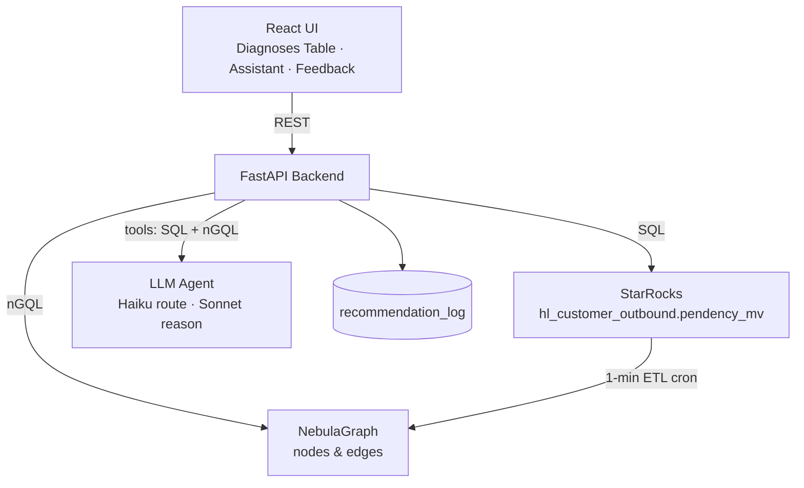
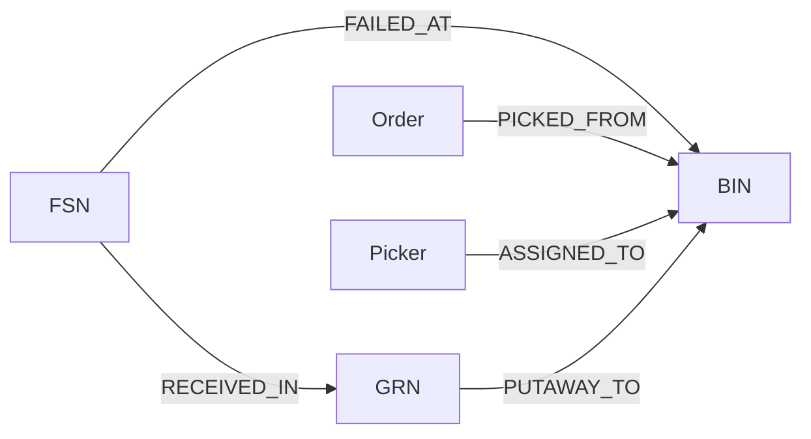

# BIN-FSN Stockout Diagnosis — Design Document

> Status: Draft v1 · Owner: Intern project · Audience: Eng leads, store-ops stakeholders
> Related: [../explanation/context-repository.md](../explanation/context-repository.md) · [milestones.md](milestones.md) · [briefing PDF](../BIN-FSN%20Stockout%20Diagnosis%20%E2%80%94%20Intern%20Briefing%20Document.pdf)

---

## 1. Problem 1-Pager

| Field | Detail |
|-------|--------|
| **Context** | In Flipkart Hyperlocal dark stores, items (FSN) live in labeled slots (BIN, e.g. `F1-05-5D`). When a picker can't find an FSN in its BIN, they raise an **INF** (Item Not Found), which spawns an **IRT** (Inventory Resolution Ticket), fails the customer order, and drops the store's fill rate. |
| **Problem** | The existing **S11** signal flags *which* FSN/BIN pairs keep failing but gives **no root cause**. Diagnosing the "why" manually takes an analyst **3-5 days** across many dashboards. |
| **Goal** | Reduce diagnostic latency from days to **minutes** via an automated Web UI + Graph/LLM assistant that maps every failure to an **actionable category** with cited evidence. |
| **Non-Goals** | No new StarRocks MVs · no Slack/email/push · no automated/unattended stocktake execution · no ML forecasting or picker coaching · no LLM fine-tuning. |
| **Constraints** | Verdict accuracy **>= 70%** vs analyst · e2e latency **< 10s** · **every** assistant claim must cite SQL/graph evidence · pilot 1 dark store for **>= 1 week**. |

---

## 2. Core Diagnostic Logic (from the PS)

The diagnostic paradigm is a 2-axis classification over INF events:

| Diagnostic Insight | Root Cause | Action |
|--------------------|-----------|--------|
| Many **distinct FSNs** failing in the **same BIN** | **PHANTOM INVENTORY** | **Stocktake the BIN** — system thinks stock is present, but it is physically misplaced/stolen/missing |
| The **same FSN** failing across **many distinct BINs** | **GENUINE STOCKOUT** | **Replenish the FSN** — inventory depleted across the facility |

### Verdict thresholds (from the PS validation SQL)

```
distinct_fsns >= 3 AND distinct_bins >= 2  ->  DUAL
distinct_fsns >= 3                         ->  PHANTOM
distinct_bins >= 2                         ->  GENUINE_STOCKOUT
else                                       ->  AMBIGUOUS
```

Where, over a time window (default last 1 day) and `irt_ticket_id IS NOT NULL`:
- `distinct_fsns` = count of distinct FSNs that failed in a given (wh, bin)
- `distinct_bins` = count of distinct BINs in which a given (wh, fsn) failed

---

## 3. Design Decisions (Detailed)

This section records each decision, the options considered, the choice, and the rationale/risks. (Format follows the context repo's `AGENTS.md`: compare >= 2 options, then choose the simplest.)

### DD-1 · Keep the PS verdict logic as the deterministic core

- **Options**: (a) Re-derive thresholds via ML; (b) keep the PS SQL CASE logic verbatim.
- **Decision**: (b) — implement the PS thresholds verbatim as the deterministic baseline verdict.
- **Why**: The PS success metric is ">= 70% match against analysts," and the PS already validated this logic. ML is explicitly out of scope. Determinism makes verdicts auditable and reproducible.
- **Risk**: Thresholds may be too rigid -> mitigated by surfacing the raw counts + graph signals so a human can override.

### DD-2 · Graph signals queried dynamically by LLM

- **Options**: (a) Pre-compute all graph signals for every diagnosis row; (b) let LLM query signals dynamically based on the question.
- **Decision**: (b) — graph signals are queried on-demand by the LLM agent using nGQL tools.
- **Why**: More flexible (agent can explore arbitrary graph paths), less overhead (only query what's needed), and aligns with Ollama's tool-calling paradigm. The deterministic verdict still stands alone if graph is unavailable.
- **Risk**: Slower UX (wait for LLM to query) -> mitigated by FAST mode (10s) and auto-bootstrap for common questions.

| Signal | Hypothesis it tests | WMS grounding | Graph path |
|--------|---------------------|---------------|-----------|
| **Picker overlap** | Failures in a BIN concentrate on one picker -> process/skill issue, not phantom | Picking Service: picker (`picklist_assigned_to`) raises INF | `Picker -[ASSIGNED_TO]-> Picklist -[FAILED_AT]-> BIN` |
| **Shared inbound batch** | FSNs failing across BINs share a GRN -> mis-receive / wrong putaway at inbound | Inventory `grnId` + Inbound `GrnEvent` | `FSN -[RECEIVED_IN]-> GRN -[PUTAWAY_TO]-> BIN` |
| **IRT / stocktake feedback** | Did a PHANTOM action actually fix it? | Inv-Audit: stocktake -> `InventoryItemVariance` (negative = confirmed loss) | `BIN -[STOCKTAKE]-> Variance` |
| **ATP cross-check** | Is a GENUINE_STOCKOUT true depletion or cache drift? | Inventory Service: `ATP = 0` vs no promisable inventory | (SQL/inventory side-lookup) |

### DD-3 · Two stores — StarRocks (analytics) + NebulaGraph (graph)

- **Options**: (a) SQL only; (b) graph only; (c) both, as the PS specifies.
- **Decision**: (c) — StarRocks for set-based aggregation, NebulaGraph for multi-hop traversals.
- **Why**: Counting failures per (wh,bin,fsn) is a natural SQL aggregation. Tracing picker overlaps and shared inbound batches is multi-hop and costly in SQL — exactly NebulaGraph's strength (as the PS notes). Matches the prescribed stack.
- **Risk**: Two stores add ops overhead -> mitigated by a thin 1-min ETL and Dockerized local infra.

### DD-4 · Single source table, no secondary MVs

- **Decision**: Read only `hl_customer_outbound.pendency_mv`; build no new StarRocks MVs (hard PS guardrail).
- **Note**: For the inbound-batch signal we reference a `grn_id` column. In the demo this is an added column on the dummy `pendency_mv` table (not a new MV). With leads we must confirm whether GRN is already joinable; if not, the shared-batch signal degrades gracefully and the rest of the system is unaffected.

### DD-5 · FastAPI backend with 3 endpoints

- **Decision**: `GET /diagnoses`, `POST /ask`, `GET/POST /feedback`.
- **Why**: Mirrors the PS architecture (relational responses on `/diagnoses`, LLM tool execution on `/ask`) and adds feedback for the closed loop. FastAPI is the PS-specified framework and is fast to stand up.

### DD-6 · LLM agent with mandatory citations (Ollama local)

- **Options**: (a) free-form LLM answers; (b) tool-calling agent that must cite every claim; (c) cloud API vs local inference.
- **Decision**: (b) with local **Ollama** (llama3.1:8b by default) — single-model tool loop with extensive deterministic fallbacks.
- **Why**: The PS makes citation a hard success metric ("every single claim"). Tool-grounding also prevents hallucinated warehouse facts. Local Ollama is **cost-effective** (no per-token charges) and **data-private** (no external API calls). Smaller models need deterministic helpers (auto-bootstrap, SQL extraction, hallucination blocking).
- **Risk**: Weaker models may struggle with tool calling -> mitigated by robust fallback logic in agent.py.

### DD-7 · Closed-loop feedback via `recommendation_log`

- **Decision**: Persist every suggestion -> action -> outcome in a `recommendation_log` table; the Feedback View reads from it.
- **Why**: The PS requires "audit-ready evidence strings" linking UI suggestions to ops changes and resolution outcomes. This is the only new table we own (allowed — it's not a StarRocks MV).

### DD-8 · Stack & repo strategy

- **Decision**: Follow the PS stack exactly — **Python FastAPI + React + NebulaGraph + StarRocks**, all Dockerized. The existing Java/Maven archetype in this repo is left untouched and unused.
- **Why**: The PS prescribes this stack; the Java archetype was scaffolding only. Mixing stacks would add friction for no benefit.

### DD-9 · Demo data strategy

- **Decision**: A Python generator seeds one dark store with clusters engineered to make each verdict obvious (see §6).
- **Why**: A compelling demo needs deterministic, explainable scenarios rather than random noise. Seeding known ground-truth also lets us measure the >= 70% accuracy metric.

---

## 4. Architecture



| Layer | Choice | Responsibility |
|-------|--------|----------------|
| Analytics | StarRocks | Aggregate INF events, compute verdict counts |
| Graph | NebulaGraph | Multi-hop signals (queried dynamically by LLM) |
| Backend | FastAPI (Python) | Diagnoses API, LLM orchestration, feedback |
| ETL | Python cron (1-min) | Sync StarRocks rows -> graph nodes/edges |
| LLM | Ollama (llama3.1:8b) | Tool loop with deterministic fallbacks, always cite |
| UI | React | 3 surfaces (table, assistant, feedback) |
| Infra | Docker Compose | Local one-command bring-up |

---

## 5. Data Model

### 5.1 StarRocks source — `hl_customer_outbound.pendency_mv` (read-only)

| Column | Meaning |
|--------|---------|
| `reservation_warehouse_id` | Dark store ID (wh) |
| `picklist_source_location_label` | Physical slot (BIN) |
| `picklist_item_fsn` | Product (FSN) |
| `irt_ticket_id` | Non-null = active INF event |
| `irt_ticket_type` | Infraction categorization enum |
| `picklist_assigned_to` | Picker ID |
| `order_id` | Impacted customer order |
| `updated_at` | Timestamp |
| `grn_id` *(demo-added)* | Inbound batch — enables shared-batch signal |

### 5.2 NebulaGraph schema

- **Tags (nodes)**: `FSN`, `BIN`, `Picker`, `Order`, `GRN`
- **Edges**: `FAILED_AT` (FSN->BIN), `PICKED_FROM` (Order->BIN), `ASSIGNED_TO` (Picker->Picklist/BIN), `RECEIVED_IN` (FSN->GRN), `PUTAWAY_TO` (GRN->BIN)



### 5.3 `recommendation_log` (owned by this system)

| Column | Meaning |
|--------|---------|
| `id` | PK |
| `warehouse_id`, `bin`, `fsn` | Diagnosis key |
| `verdict` | PHANTOM / GENUINE_STOCKOUT / DUAL / AMBIGUOUS |
| `action` | Suggested action (stocktake / replenish) |
| `status` | suggested / acknowledged / executed / verified |
| `suggested_at`, `resolved_at` | Timestamps |
| `evidence_ref` | Cited SQL/graph evidence string |
| `failures_before`, `failures_after` | Closed-loop verification counts |

---

## 6. Dummy Data Scenarios

The generator seeds one dark store with these ground-truth clusters:

| Scenario | Shape | Expected verdict |
|----------|-------|------------------|
| **Phantom BIN** | Many distinct FSNs failing in one BIN | PHANTOM |
| **Genuine stockout FSN** | One FSN failing across many BINs | GENUINE_STOCKOUT |
| **Picker-driven cluster** | One picker, one BIN, several fails | PHANTOM verdict but graph flags picker concentration |
| **Shared-GRN cluster** | FSNs failing that share a `grn_id` | GENUINE-like, but graph flags inbound batch root cause |
| **Background noise** | Random low-volume fails + non-INF rows | AMBIGUOUS / filtered out |
| **Resolved cases** | A few `recommendation_log` rows where failures ceased after action | Feedback View demo |

---

## 7. UI Surfaces (from the PS)

1. **Diagnoses Table** — ranked list by (wh, BIN, FSN) with verdict, the raw evidence counts (distinct_fsns / distinct_bins / picker concentration / shared GRN), and an expected fill-rate recovery projection.
2. **Ask the Assistant** — NL box ("Why is BIN F1-05-5D failing?", "How can I improve fill rate today?"). Every answer cites the exact SQL rows / nGQL paths used.
3. **Feedback View** — closed-loop tracking from `recommendation_log`: was the action taken, and did the localized failures cease?

---

## 8. Success Metrics (from the PS)

| Metric | Target |
|--------|--------|
| Verdict accuracy vs analysts | >= 70% |
| E2E latency (interaction -> render) | < 10s |
| Assistant citation coverage | 100% of claims |
| Pilot uptime | >= 1 week, 1 dark store |
| Audit-ready evidence | suggestion -> action -> outcome linkage |

---

## 9. Open Clarifications (PS §7 — confirm with leads)

- Exact `irt_ticket_type` enum value that strictly isolates an INF (demo assumes `irt_ticket_id IS NOT NULL`).
- Is `picklist_source_location_label` 1:1 with the physical BIN across all regions?
- How are stocktake/replenishment closures pushed back into logs (for clean feedback measurement)?
- UI auth system (Flipkart SSO?) — demo uses a stub login.
- Per-warehouse LLM token/cost ceiling.
- Managed NebulaGraph cluster vs self-hosted.

---

## 10. Risks & Mitigations

| Risk | Mitigation |
|------|-----------|
| Graph store unavailable | Deterministic verdict still works from SQL alone; graph signals are additive |
| GRN not joinable in real `pendency_mv` | Shared-batch signal degrades gracefully; confirm with leads |
| LLM hallucination | Tool-grounded answers + mandatory citation enforcement |
| LLM cost overrun | Haiku-first routing + per-warehouse ceiling |
| Latency > 10s | Cache verdict computation; pre-warm graph; keep ETL window small |
