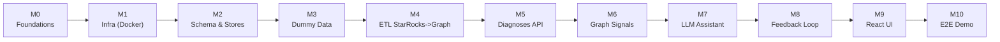

# BIN-FSN Stockout Diagnosis — Milestone Implementation Plan

> Companion to [design-doc.md](design-doc.md). This file breaks the build into
> structured, sequential milestones. Each milestone has a goal, concrete tasks,
> deliverables, and an exit criterion ("Definition of Done"). Build bottom-up:
> infra -> data -> backend -> intelligence -> UI -> demo.

---

## Milestone Map (at a glance)

---

## M0 · Foundations & Repo Setup

- **Goal**: A clean Python+JS project skeleton with the PS stack.
- **Tasks**:
  - Create target layout: `backend/`, `frontend/`, `data/`, `infra/`, `docs/`.
  - Add `backend/requirements.txt` (FastAPI, uvicorn, StarRocks/MySQL client, nebula3-python, anthropic, pydantic).
  - Add `.env.example` (DB hosts, NebulaGraph host, `ANTHROPIC_API_KEY`).
  - Decide to leave the existing Maven archetype untouched.
- **Deliverable**: Buildable empty backend + frontend scaffolds.
- **DoD**: `uvicorn` boots a hello-world FastAPI; `npm run dev` serves a blank React app.

---

## M1 · Local Infrastructure (Docker Compose)

- **Goal**: One-command bring-up of StarRocks + NebulaGraph.
- **Tasks**:
  - `infra/docker-compose.yml` with StarRocks (FE+BE) and NebulaGraph (metad, storaged, graphd).
  - Health-check / readiness wait scripts.
  - Document ports and connection strings.
- **Deliverable**: `docker compose up` brings both stores online.
- **DoD**: Can connect to StarRocks via MySQL client and to NebulaGraph via console.

---

## M2 · Schema & Stores

- **Goal**: Create all tables and graph schema.
- **Tasks**:
  - StarRocks: create `hl_customer_outbound.pendency_mv`-shaped table (incl. demo `grn_id`).
  - StarRocks: create `recommendation_log` table.
  - NebulaGraph: create space, tags (`FSN`, `BIN`, `Picker`, `Order`, `GRN`), edges (`FAILED_AT`, `PICKED_FROM`, `ASSIGNED_TO`, `RECEIVED_IN`, `PUTAWAY_TO`), and indexes.
- **Deliverable**: `data/schema/` DDL scripts (SQL + nGQL).
- **DoD**: All tables/tags/edges exist and are queryable; idempotent re-run safe.

---

## M3 · Dummy Data Generation

- **Goal**: Realistic, ground-truth-labeled data for one dark store.
- **Tasks**:
  - `data/generate_dummy_data.py` producing the 6 scenarios from design-doc §6.
  - Loader to insert rows into StarRocks `pendency_mv`.
  - Keep a ground-truth label map (for accuracy measurement).
- **Deliverable**: Reproducible seed (fixed random seed) + a few `recommendation_log` resolved cases.
- **DoD**: Running the PS validation SQL returns the expected verdicts for each seeded cluster.

---

## M4 · ETL: StarRocks -> NebulaGraph (1-min cron)

- **Goal**: Keep the graph in sync with analytics.
- **Tasks**:
  - `backend/etl/sync.py`: read recent INF rows, upsert nodes (FSN/BIN/Picker/Order/GRN) and edges.
  - Idempotent upserts; incremental by `updated_at` watermark.
  - Schedule at 1-min interval (cron or APScheduler).
- **Deliverable**: A running sync that mirrors StarRocks into the graph.
- **DoD**: After seeding, the graph contains all expected nodes/edges; re-runs don't duplicate.

---

## M5 · Diagnoses API (`GET /diagnoses`)

- **Goal**: Deterministic verdict engine over the PS SQL.
- **Tasks**:
  - `services/diagnosis.py`: implement the PS CTE + CASE verdict logic.
  - Endpoint returns ranked (wh, bin, fsn) with verdict, counts, and fill-rate recovery projection.
  - Add time-window param (default 1 day).
- **Deliverable**: Working `GET /diagnoses` returning seeded clusters with correct verdicts.
- **DoD**: Verdicts match ground-truth labels (>= 70% target; expect ~100% on seeded data).

---

## M6 · Graph Signal Enrichment

- **Goal**: Add the 4 multi-hop root-cause signals (design-doc DD-2).
- **Tasks**:
  - `services/graph.py`: nGQL queries for picker overlap, shared-GRN batch, stocktake feedback.
  - ATP cross-check stub (or simulated column) for GENUINE_STOCKOUT validation.
  - Merge signals into each diagnosis row as explanatory evidence.
- **Deliverable**: `/diagnoses` rows now carry picker-concentration and shared-GRN flags.
- **DoD**: The picker-driven and shared-GRN seeded clusters are correctly flagged.

---

## M7 · LLM Assistant (`POST /ask`)

- **Goal**: Cited, tool-grounded natural-language answers.
- **Tasks**:
  - `services/llm.py`: tool-calling agent with `run_sql` and `run_ngql` tools.
  - Haiku 4.5 for routing/tagging; Sonnet 4.6 for complex reasoning.
  - Enforce: every claim references returned rows/paths (citation block in response).
- **Deliverable**: `POST /ask` answering "Why is BIN X failing?" / "How to improve fill rate today?".
- **DoD**: Answers are correct on seeded data and include citations for every claim; < 10s.

---

## M8 · Closed-Loop Feedback (`/feedback`)

- **Goal**: Track suggestion -> action -> outcome.
- **Tasks**:
  - `GET/POST /feedback` reading/writing `recommendation_log`.
  - Compute `failures_before` vs `failures_after` to verify if failures ceased.
- **Deliverable**: Feedback endpoints + verification logic.
- **DoD**: Resolved seeded cases show "failures ceased"; new suggestions can be logged and advanced through statuses.

---

## M9 · React UI (3 surfaces)

- **Goal**: The store-manager web app.
- **Tasks**:
  - **Diagnoses Table**: ranked grid, verdict badges, evidence columns, recovery projection.
  - **Ask the Assistant**: chat box rendering answers + citations.
  - **Feedback View**: closed-loop tracking layout.
  - Stub login (auth TBD with leads).
- **Deliverable**: Running React app wired to the backend.
- **DoD**: All three surfaces function against live backend data.

---

## M10 · E2E Demo Integration

- **Goal**: One-command, demo-ready system.
- **Tasks**:
  - Add backend + frontend services to `docker-compose.yml`.
  - Seed-on-startup script; smoke test the full path.
  - Validate latency < 10s and verdict accuracy on seeded data.
  - Write a short demo runbook (what to click, what to ask).
- **Deliverable**: Full stack via `docker compose up` + demo script.
- **DoD**: Live demo shows: table verdicts -> ask assistant (with citations) -> feedback loop, all < 10s.

---

## Sequencing & Dependencies

| Milestone | Depends on | Can parallelize with |
|-----------|-----------|----------------------|
| M0 | — | — |
| M1 | M0 | — |
| M2 | M1 | — |
| M3 | M2 | M4 schema parts |
| M4 | M2, M3 | M5 |
| M5 | M3 | M4 |
| M6 | M4, M5 | — |
| M7 | M5, M6 | M9 (UI scaffolding) |
| M8 | M5 | M7 |
| M9 | M5 (then M6/M7/M8 for full data) | M7/M8 |
| M10 | all | — |

---

## Definition of Done (whole project)

- `docker compose up` brings up StarRocks, NebulaGraph, backend, and frontend.
- Seeded dark store shows correct PHANTOM / GENUINE_STOCKOUT / DUAL verdicts.
- Graph signals correctly disambiguate picker-driven and shared-GRN clusters.
- Assistant answers NL questions with 100% cited claims, < 10s.
- Feedback view shows at least one closed loop (failures ceased after action).
- All design decisions in [design-doc.md](design-doc.md) are reflected in the build.

---

## Milestone Checklist

> Tick a box when you complete it. For each milestone, also tick its doc tracks
> (journal / HLD / LLD / code walkthrough). Mirror these ticks in
> [../CLAUDE.md](../CLAUDE.md) §7 (or run `/milestone-complete N`).

- [x] **M0 · Foundations & repo setup**
  - [x] code  · [x] journal  · [x] HLD  · [x] LLD  · [x] code-walkthrough
- [x] **M1 · Local infra (Docker: StarRocks + NebulaGraph)**
  - [x] code  · [x] journal  · [x] HLD  · [x] LLD  · [x] code-walkthrough
- [x] **M2 · Schema & stores**
  - [x] code  · [x] journal  · [x] HLD  · [x] LLD  · [x] code-walkthrough
- [x] **M3 · Dummy data generation**
  - [x] code  · [x] journal  · [x] HLD  · [x] LLD  · [x] code-walkthrough
- [x] **M4 · ETL StarRocks -> NebulaGraph (1-min)**
  - [x] code  · [x] journal  · [x] HLD  · [x] LLD  · [x] code-walkthrough
- [x] **M5 · Diagnoses API (GET /diagnoses)**
  - [x] code  · [x] journal  · [x] HLD  · [x] LLD  · [x] code-walkthrough
- [x] **M6 · Graph signal enrichment**
  - [x] code  · [x] journal  · [x] HLD  · [x] LLD  · [x] code-walkthrough
- [x] **M7 · LLM assistant (POST /ask)**
  - [x] code  · [x] journal  · [x] HLD  · [x] LLD  · [x] code-walkthrough
- [x] **M8 · Closed-loop feedback (/feedback)**
  - [x] code  · [x] journal  · [x] HLD  · [x] LLD  · [x] code-walkthrough
- [x] **M9 · React UI (3 surfaces)**
  - [x] code  · [x] journal  · [x] HLD  · [x] LLD  · [x] code-walkthrough
- [x] **M10 · E2E demo integration**
  - [x] code  · [x] journal  · [x] HLD  · [x] LLD  · [x] code-walkthrough · [x] README
