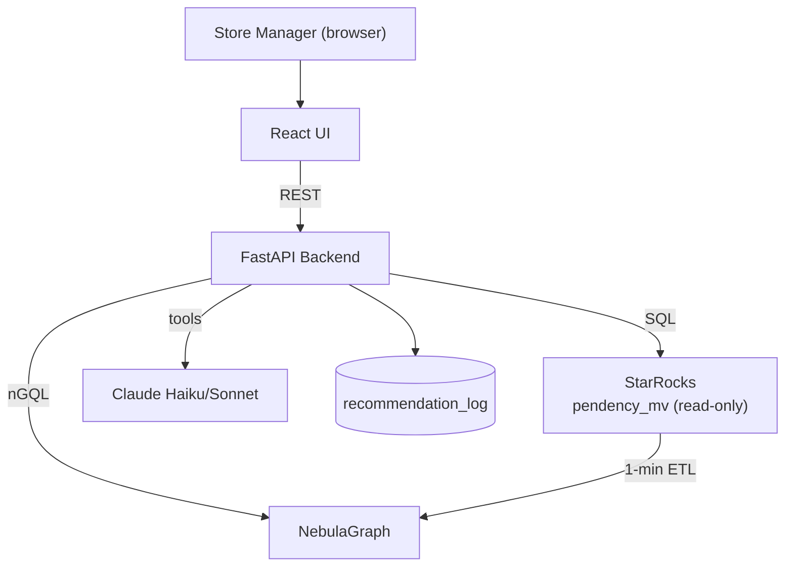

# HLD 02 · Architecture

## Components

| Component | Tech | Responsibility |
|-----------|------|----------------|
| UI | React | Diagnoses Table, Assistant, Feedback |
| Backend | FastAPI | `/diagnoses`, `/ask`, `/feedback`; LLM orchestration |
| Analytics | StarRocks | Aggregate INF; verdict counts |
| Graph | NebulaGraph | Multi-hop signals |
| ETL | Python cron (1-min) | StarRocks -> graph |
| LLM | Claude Haiku/Sonnet | Route/reason; cite |
| Infra | Docker Compose | One-command bring-up |

## Boundaries

This system is read-only over the source table and owns only `recommendation_log`
and the NebulaGraph projection. The WMS pipeline remains the source of truth.
