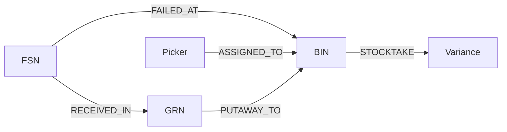

# HLD 04 · E2E Extension (Graph Signals)

Beyond FSN x BIN, four signals explain *why* a BIN/FSN fails. Each is grounded in
a real WMS service documented in the context repo.

| Signal | Tells us | Source service |
|--------|----------|----------------|
| Picker overlap | Process/skill issue vs phantom | Picking |
| Shared inbound batch (GRN) | Mis-receive/putaway vs depletion | Inbound + Inventory |
| IRT/stocktake feedback | Did the action fix it? | Inv-Audit |
| ATP cross-check | True depletion vs cache drift | Inventory |

Signals are **additive**: the deterministic verdict still stands if the graph is
unavailable.
