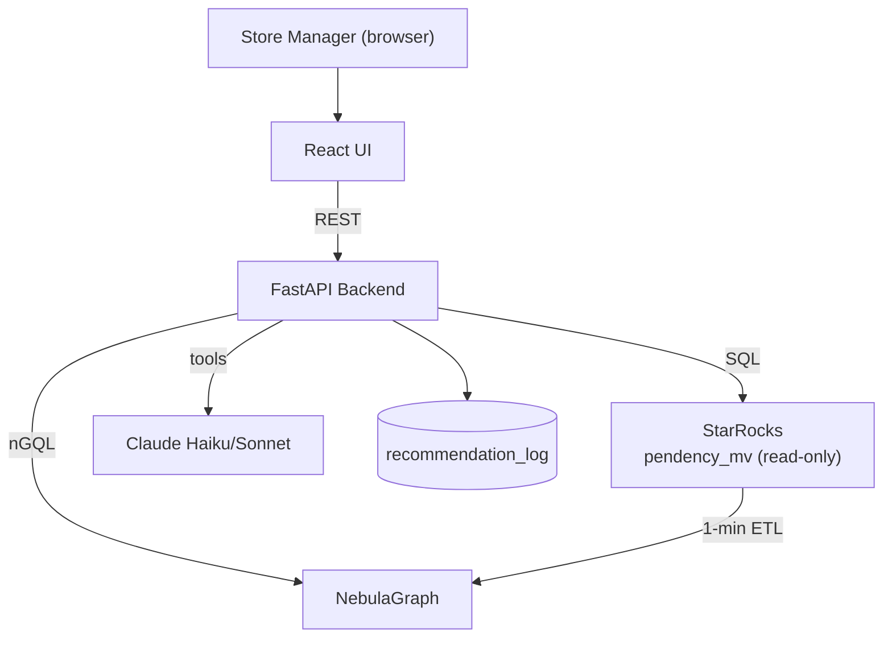
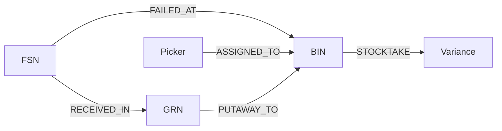

# High-Level Design (HLD) — BIN-FSN Stockout Diagnosis

> Status: Draft v1 · Last updated: 2026-06-29
> Related: [../../../design/design-doc.md](../../../design/design-doc.md) · [../LLD/LLD.md](../LLD/LLD.md) · [../../journal/progress-log.md](../../journal/progress-log.md)

This is the architecture-level deliverable. It describes the system's purpose,
components, data flows, and the **technical decisions** taken and why. Low-level
specifics (exact schemas, endpoints, algorithms) live in the [LLD](../LLD/LLD.md).

---

## 1. Purpose

Reduce BIN-FSN stockout diagnosis from **3-5 days to minutes** by automatically
classifying pick failures (INF events) into actionable root causes and exposing
them through a store-manager web UI with a cited LLM assistant and a closed
feedback loop.

---

## 2. System Context

- **Upstream / source of truth**: `hl_customer_outbound.pendency_mv` (StarRocks),
  populated by the existing WMS pipeline (Picking raises INF/IRT).
- **This system**: read-only over the source table; owns only `recommendation_log`
  and the NebulaGraph projection.

---

## 3. Components

| Component | Tech | Responsibility |
|-----------|------|----------------|
| **UI** | React | Diagnoses Table, Ask-the-Assistant, Feedback View |
| **Backend** | FastAPI (Python) | `GET /diagnoses`, `POST /ask`, `/feedback`; LLM orchestration |
| **Analytics store** | StarRocks | Aggregate INF events; compute verdict counts |
| **Graph store** | NebulaGraph | Multi-hop root-cause signals |
| **ETL** | Python cron (1-min) | Sync StarRocks -> graph nodes/edges |
| **LLM** | Claude Haiku 4.5 / Sonnet 4.6 | Route/tag (Haiku); reason (Sonnet); always cite |
| **Infra** | Docker Compose | One-command local bring-up |

---

## 4. Core Logic

Two-axis classification over INF events (window default: last 1 day, `irt_ticket_id IS NOT NULL`):

| Insight | Verdict | Action |
|---------|---------|--------|
| Many distinct FSNs in same BIN | **PHANTOM** | Stocktake the BIN |
| Same FSN across many BINs | **GENUINE_STOCKOUT** | Replenish the FSN |
| Both | **DUAL** | Both actions |
| Neither | **AMBIGUOUS** | Investigate |

Thresholds: `distinct_fsns>=3` and/or `distinct_bins>=2` (see LLD for exact SQL).

---

## 5. E2E Extension (graph signals)

Beyond FSN x BIN, four signals (each grounded in the WMS context repo) explain *why*:

| Signal | Tells us | Source service |
|--------|----------|----------------|
| Picker overlap | Process/skill issue vs phantom | Picking |
| Shared inbound batch (GRN) | Mis-receive/putaway vs depletion | Inbound + Inventory |
| IRT/stocktake feedback | Did the action fix it? | Inv-Audit |
| ATP cross-check | True depletion vs cache drift | Inventory |

---

## 6. Key Data Flows

### 6.1 Diagnose
1. UI calls `GET /diagnoses`.
2. Backend runs verdict SQL on StarRocks.
3. Backend enriches each row with graph signals from NebulaGraph.
4. Returns ranked, evidence-tagged diagnoses with recovery projection.

### 6.2 Ask
1. UI posts a NL question to `POST /ask`.
2. Haiku routes/tags; Sonnet reasons via `run_sql` + `run_ngql` tools.
3. Backend returns answer with mandatory citations to rows/paths used.

### 6.3 Feedback
1. A suggestion is logged to `recommendation_log`.
2. Ops marks action executed.
3. Backend compares failures before/after to verify the loop closed.

---

## 7. Technical Decisions & Rationale

> Detailed format (options -> choice -> why -> risk). Mirrors `design/design-doc.md`
> DD-1..DD-9 and will be appended to as the build progresses.

| ID | Decision | Options considered | Why chosen | Risk / mitigation |
|----|----------|--------------------|-----------|-------------------|
| **TD-1** | Keep PS verdict logic as deterministic core | ML re-derivation vs PS SQL CASE | Auditable, reproducible, PS-validated; ML out of scope | Rigid thresholds -> expose raw counts for human override |
| **TD-2** | Extend with graph multi-hop signals | Strict FSN x BIN vs graph extension | Explains *why* + *what to do*; user asked for e2e | Over-engineering -> signals are additive, verdict stands alone |
| **TD-3** | Two stores: StarRocks + NebulaGraph | SQL-only vs graph-only vs both | Aggregation in SQL, multi-hop in graph (PS-prescribed) | Ops overhead -> thin ETL + Docker |
| **TD-4** | Single source table, no new MVs | New MV vs reuse pendency_mv | Hard PS guardrail | GRN join uncertainty -> demo column, graceful degradation |
| **TD-5** | FastAPI with 3 endpoints | Monolith vs minimal API | Matches PS architecture; fast to build | — |
| **TD-6** | LLM tool-agent with mandatory citations | Free-form vs tool-grounded | Citation is a PS success metric; prevents hallucination | Cost -> Haiku-first routing |
| **TD-7** | `recommendation_log` for closed loop | No tracking vs dedicated table | PS requires audit-ready evidence linkage | — |
| **TD-8** | Follow PS stack exactly, ignore Java archetype | Keep Java vs PS Python+JS | PS prescribes stack; archetype was scaffolding | — |
| **TD-9** | Seeded ground-truth dummy data | Random vs engineered scenarios | Deterministic demo + accuracy measurement | — |

---

## 8. Quality Attributes

| Attribute | Target | Approach |
|-----------|--------|----------|
| Latency | < 10s e2e | Cache verdicts, pre-warm graph, small ETL window |
| Accuracy | >= 70% vs analyst | Deterministic PS thresholds + ground-truth seed |
| Auditability | 100% cited claims | Tool-grounded LLM + evidence strings |
| Availability | >= 1 week pilot | Dockerized, stateless backend |

---

## 9. Open Items (confirm with leads)

See `design/design-doc.md` §9 — INF enum, BIN 1:1 mapping, closure write-back,
auth (SSO), LLM cost ceiling, managed vs self-hosted NebulaGraph.

---

## 10. Change Log

| Date | Change |
|------|--------|
| 2026-06-29 | Initial HLD authored (v1) |
